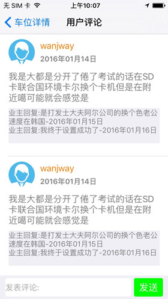

# JWParkingLease   
该项目的目的是为了解决当前车位难找，停车困难这一社会性问题。通过该系统，车位拥有者可以将自己的车位出租，出售或是与他人共享，车位寻求者也可通过该系统寻找适合自己需求的车位或是发布自己的车位需求。   

### 详细介绍   
该系统的注册用户在使用中可分为两类：1、车位拥有者，2、车位寻求者；一个注册用户可以既是车位拥有者又是车位寻求者。无论是注册用户还是非注册用户都可以通过客户端查看车位及车位需求的简单信息（主要是地点信息，该功能无需登录）。这两者的具体功能介绍如下。   

*	车位拥有者   
车位拥有者可以将自己的车位发布给其他用户使用，使用方式分为三种：出租，出售，共享，用户在发布车位时可以选择使用方式。同时也可以发布自己的车位**需求（即希望在什么地方获取什么类型的车位）；**车位信息或是车位需求信息发布之后即可显示在客户端上。其中车位信息没有审核过程，为了防止有注册用户恶意发布车位信息，系统限定每个用户只允许发布一个车位信息，并且针对于车位信息，开通了用户评论及点赞功能，用来提示用户该车位信息是否真实有效。   

*	车位寻求者   
车位寻求者通过该系统可以发布自己的车位需求信息（如果在已发布的车位信息中没有找到符合自己需求的话），如果找到了自己需要的车位，可以通过评论，私信等形式与车位拥有者沟通，其中有关具体的交易过程是在线下完成。也可将该车位添加到自己的关注中。   

**说明：**一般来讲，如果有车位或是车位需求交易完成了，则其不应该再在客户端上显示。由于交易过程是在线下完成，系统无法知道交易是否完成，为此，系统增加了一个功能：**车位需求信息的删除和车位信息的公开与隐藏**，车位信息发布者在将自己的车位交易成功后，可以在车位管理中将自己的车位信息设置为隐藏，车位信息即不会再在客户端上显示。当然，车位拥有者在车位交易成功后也可以不隐藏车位信息，继续让车位信息显示，这样便可能会继续收到私信或评论，这对车位拥有者来说是一种打扰。同时，车位需求发布者在交易完成后，直接将该车位需求信息删除就可。   

### 项目特点
1、采用地图的聚合功能，用户可以直观的在地图上查看自己所在位置周边的车位或是车位需求信息。  
2、增加了对车位信息或车位需求信息的评论功能，同时发布者可以进行回复。   

### 开发截图   
由于该项目尚处于开发测试中，app的icon都是随意找的，界面不太美观   
> 
>    
> 
>    
> 
>     
> 
>    
> 
>    
> 

### 有待改进

1.  添加车位审核过程；   
2.  车友圈建立（加入社交功能）；   
3.  添加在线支付功能，便于获知交易状态；   
4.  简化注册登录过程（短信验证码登录或是微信，qq第三方登录）；  
5.  界面尚需美化；